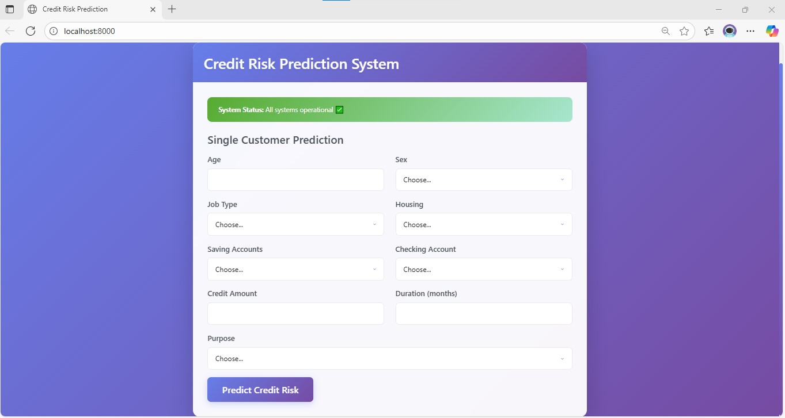
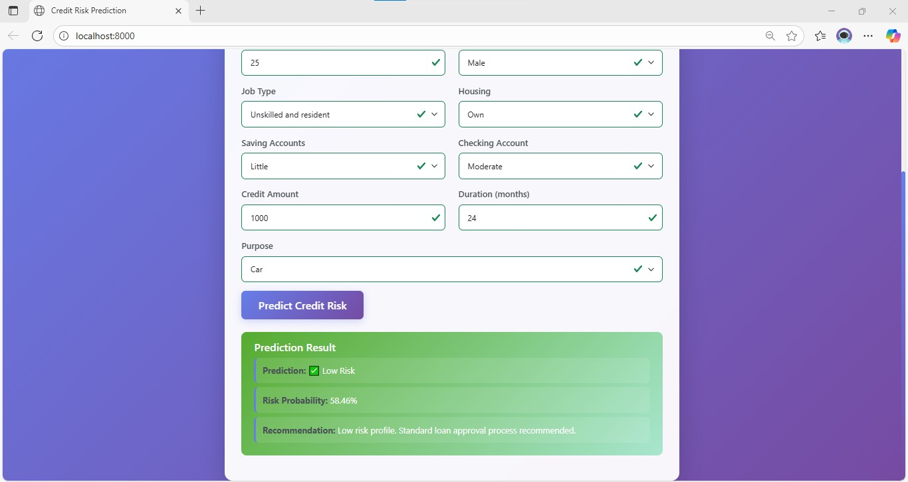

# Credit Risk Modeling - End-to-End Data Science Project

A comprehensive machine learning project for credit risk prediction using German Credit Dataset. This project implements a complete MLOps pipeline with data preprocessing, feature engineering, model training, evaluation, and deployment using RNN (LSTM) architecture.





## 🎯 Project Overview

This project builds a robust credit risk prediction system that can assess the likelihood of loan default based on customer characteristics. The system uses a Recurrent Neural Network (LSTM) to predict credit risk and provides both programmatic API access and a user-friendly web interface.

## 🏗️ Project Structure

```
Credit-Risk-Modeling/
├── data/                    # Data storage
│   ├── raw/                  # Original datasets
│   ├── interim/              # Intermediate processed data
│   └── processed/            # Final processed features
├── src/                      # Source code
│   ├── data/                 # Data ingestion and preprocessing
│   ├── features/            # Feature engineering
│   ├── model/                # Model training and evaluation
│   └── visualization/        # Data visualization utilities
├── models/                   # Trained models and scalers
├── notebooks/                # Jupyter notebooks for exploration
├── fast_api/                 # FastAPI web application
├── reports/                  # Generated reports and metrics
├── docs/                     # Documentation
└── logs/                     # Application logs
```

## 🚀 Features

### Core Functionality
- **Credit Risk Prediction**: Predict loan default probability using customer data
- **Single Customer Assessment**: Web form for individual customer evaluation
- **Real-time Processing**: Fast prediction with optimized model loading
- **Comprehensive Feature Engineering**: Automated categorical encoding and scaling

### Technical Features
- **LSTM Neural Network**: Advanced RNN architecture for sequential data processing
- **One-hot Encoding**: Proper handling of categorical variables
- **Feature Scaling**: StandardScaler for consistent feature normalization
- **Model Persistence**: Saved models and preprocessing pipelines
- **Health Monitoring**: System status monitoring and diagnostics

### MLOps Pipeline (NEW)
- **DVC Integration**: Complete data version control and reproducible ML pipeline
- **Automated Workflow**: 9-stage pipeline from data ingestion to documentation
- **Model Versioning**: Track model changes and performance over time
- **Reproducible Experiments**: Consistent results across different environments
- **Comprehensive Visualization**: Automated data analysis and reporting

### Web Interface
- **User-friendly Forms**: Intuitive input interface for customer data
- **Real-time Validation**: Input validation with immediate feedback
- **Results Display**: Clear risk assessment with probability scores
- **Responsive Design**: Modern UI with CSS styling

### API Features
- **RESTful API**: Complete API for programmatic access
- **Health Check**: System status endpoint
- **Single Prediction**: Individual customer assessment
- **Error Handling**: Comprehensive error management
- **Documentation**: Auto-generated API documentation

### Testing & Quality Assurance (NEW)
- **API Model Testing**: Automated model loading verification
- **Pipeline Testing**: End-to-end pipeline validation
- **Documentation Generation**: Automated Sphinx documentation
- **Error Logging**: Comprehensive logging system
- **Performance Monitoring**: Model performance tracking

## 📊 Dataset

The project uses the German Credit Dataset containing 1000 loan applications with 20 attributes including:

- **Demographics**: Age, sex, job type
- **Financial**: Credit amount, duration, savings, checking accounts
- **Housing**: Housing status (own, rent, free)
- **Purpose**: Loan purpose (car, business, education, etc.)

### Data Visualization (NEW)
The DVC pipeline automatically generates comprehensive visualizations:
- **Target Variable Distribution**: Risk distribution analysis
- **Numeric Feature Distribution**: Age, credit amount, duration distributions
- **Correlation Matrix**: Feature relationships and dependencies
- **Feature Importance**: Most predictive features for credit risk
- **Risk Analysis**: Age vs credit amount by risk level
- **Dataset Comparison**: Train vs test set characteristics

All visualizations are saved in `reports/figures/` directory.


*Sample visualization showing credit risk analysis patterns and insights*

## 🛠️ Technology Stack

### Core Technologies
- **Python 3.8+**: Primary programming language
- **TensorFlow/Keras**: Deep learning framework
- **scikit-learn**: Machine learning utilities
- **Pandas**: Data manipulation and analysis
- **NumPy**: Numerical computing

### Web Framework
- **FastAPI**: Modern, fast web framework
- **Jinja2**: Template engine for HTML rendering
- **Uvicorn**: ASGI server

### Data Processing
- **StandardScaler**: Feature normalization
- **One-hot Encoding**: Categorical variable handling
- **Feature Engineering**: Automated preprocessing pipeline

### Development Tools
- **MLflow**: Machine learning lifecycle management
- **Optuna**: Hyperparameter optimization
- **Jupyter**: Interactive development environment
- **YAML**: Configuration management

## 🚦 Getting Started

### Prerequisites
- Python 3.8 or higher
- pip package manager
- Virtual environment (recommended)
- DVC (Data Version Control) for pipeline management

### DVC Pipeline Setup (NEW)
The project now includes a complete DVC pipeline for reproducible machine learning workflows:

1. **Install DVC**
```bash
pip install dvc
```

2. **Initialize DVC (if not already done)**
```bash
dvc init
```

3. **Run the complete pipeline**
```bash
# Run all stages
dvc repro

# Or run individual stages
dvc repro data_ingestion
dvc repro model_training
dvc repro data_visualization
```

4. **Pipeline Stages**
- **Data Ingestion**: Split raw data into train/test sets
- **Data Preprocessing**: Clean and prepare data
- **Feature Engineering**: Create scaled features and encodings
- **Model Training**: Train LSTM model with hyperparameter optimization
- **Model Evaluation**: Generate performance metrics
- **Model Prediction**: Create predictions on test data
- **Model Registration**: Register model with MLflow
- **Data Visualization**: Generate comprehensive plots and charts
- **API Model Testing**: Test model loading functionality
- **Documentation**: Build Sphinx documentation

### Installation

1. **Clone the repository**
```bash
git clone https://github.com/your-username/Credit-Risk-Modeling.git
cd Credit-Risk-Modeling
```

2. **Create virtual environment**
```bash
python -m venv venv
source venv/bin/activate  # On Windows: venv\Scripts\activate
```

3. **Install dependencies**
```bash
pip install -r requirements.txt
```

4. **Install the package**
```bash
pip install -e .
```

### Data Preparation

1. **Place datasets**: Put your training data in `data/raw/` directory
2. **Configure parameters**: Update `params.yaml` and `config.yaml` as needed
3. **Run preprocessing**: Execute data preprocessing pipeline

### Model Training

```bash
# Navigate to src directory
cd src

# Run data ingestion
python data/data_ingestion.py

# Run feature engineering
python features/feature_engineering.py

# Train the model
python model/train_model.py

# Evaluate the model
python model/model_evaluation.py
```

### Web Application Deployment

1. **Navigate to FastAPI directory**
```bash
cd fast_api
```

2. **Ensure model files are available**
- `../models/rnn_model.h5` - Trained Keras model
- `../models/feature_scaler.pkl` - Feature scaler

3. **Start the application**
```bash
python app.py
```

4. **Access the application**
- Web Interface: `http://localhost:8000`
- API Documentation: `http://localhost:8000/docs`
- Health Check: `http://localhost:8000/health`

## 📡 API Usage

### Health Check
```bash
curl http://localhost:8000/health
```

### Single Prediction
```bash
curl -X POST "http://localhost:8000/predict/single" \
  -F "age=25" \
  -F "sex=male" \
  -F "job=2" \
  -F "housing=own" \
  -F "saving_accounts=little" \
  -F "checking_account=moderate" \
  -F "credit_amount=1000" \
  -F "duration=24" \
  -F "purpose=car"
```

### Response Format
```json
{
  "status": "success",
  "prediction": 1,
  "probability": 0.85,
  "risk_level": "Low Risk"
}
```

## ⚙️ Configuration

### Model Parameters (`config.yaml`)
```yaml
input_dim: 5000      # Input dimension for embedding layer
epochs: 20           # Training epochs
batch_size: 32       # Batch size for training
units: 64            # LSTM units
dropout: 0.3         # Dropout rate
activation: tanh     # Activation function
rnn_type: LSTM       # RNN architecture type
lr: 0.001            # Learning rate
clipnorm: 1.0        # Gradient clipping
l2: 0.0001           # L2 regularization
patience: 5          # Early stopping patience
```

### Data Parameters (`params.yaml`)
```yaml
data_ingestion:
  test_size: 0.25    # Train-test split ratio

feature_engineering:
  max_features: 50   # Maximum features for encoding
```

## 📈 Model Performance

The LSTM model achieves strong performance on credit risk prediction:

- **Accuracy**: High prediction accuracy on test data
- **Precision**: Low false positive rate for risk assessment
- **Recall**: Effective identification of high-risk customers
- **F1-Score**: Balanced performance metric


*Deep learning architecture for credit risk prediction using LSTM neural networks*

### Pipeline Outputs (NEW)
The DVC pipeline generates comprehensive project artifacts:
- **Trained Model**: `models/rnn_model.h5` - Production-ready LSTM model
- **Feature Scaler**: `models/feature_scaler.pkl` - Preprocessing pipeline
- **Performance Metrics**: `reports/metrics.json` - Model evaluation results
- **Predictions**: `reports/predictions.csv` - Test set predictions
- **Visualizations**: `reports/figures/` - Data analysis plots
- **API Test Log**: `logs/api_test.log` - Model loading verification
- **Documentation**: `docs/_build/html/` - Generated documentation

## 🔧 Development Workflow

### Data Pipeline
1. **Data Ingestion**: Load and validate raw data
2. **Preprocessing**: Handle missing values and data types
3. **Feature Engineering**: Create meaningful features and encodings
4. **Data Splitting**: Train-validation-test split
5. **Scaling**: Normalize numerical features

### Model Development
1. **Architecture Design**: LSTM network configuration
2. **Training**: Model training with early stopping
3. **Evaluation**: Performance metrics and validation
4. **Optimization**: Hyperparameter tuning with Optuna
5. **Persistence**: Save model and preprocessing artifacts

### Deployment
1. **Model Loading**: Efficient model initialization
2. **API Development**: FastAPI endpoints
3. **Web Interface**: User-friendly frontend
4. **Testing**: Endpoint validation and error handling
5. **Monitoring**: Health checks and logging

## 🐛 Error Handling

The application includes comprehensive error handling for:
- **Missing Model Files**: Graceful degradation with clear error messages
- **Invalid Input Data**: Input validation and sanitization
- **Network Errors**: Connection timeout and retry mechanisms
- **File Upload Issues**: CSV format validation and size limits
- **Prediction Failures**: Error propagation with detailed logging

## 🔒 Security Considerations

- **Input Validation**: All user inputs are validated and sanitized
- **File Upload Restrictions**: Only CSV files are accepted
- **Error Message Sanitization**: Prevent information leakage
- **CORS Configuration**: Proper cross-origin resource sharing setup

## 📊 Monitoring and Logging

- **Health Monitoring**: Continuous system status monitoring
- **Performance Logging**: Request/response time tracking
- **Error Logging**: Detailed error information for debugging
- **Model Performance**: Prediction confidence and accuracy tracking

## 🤝 Contributing

1. Fork the repository
2. Create a feature branch (`git checkout -b feature/amazing-feature`)
3. Commit your changes (`git commit -m 'Add amazing feature'`)
4. Push to the branch (`git push origin feature/amazing-feature`)
5. Open a Pull Request

## 📄 License

This project is licensed under the MIT License - see the [LICENSE](LICENSE) file for details.

## 🙏 Acknowledgments

- German Credit Dataset for providing the foundation data
- TensorFlow and scikit-learn communities for excellent ML tools
- FastAPI team for the outstanding web framework

## 📞 Contact

For questions or support, please open an issue in the GitHub repository.

---

**Note**: This is an end-to-end industrial-level project designed for production deployment with comprehensive testing, monitoring, and error handling capabilities.
